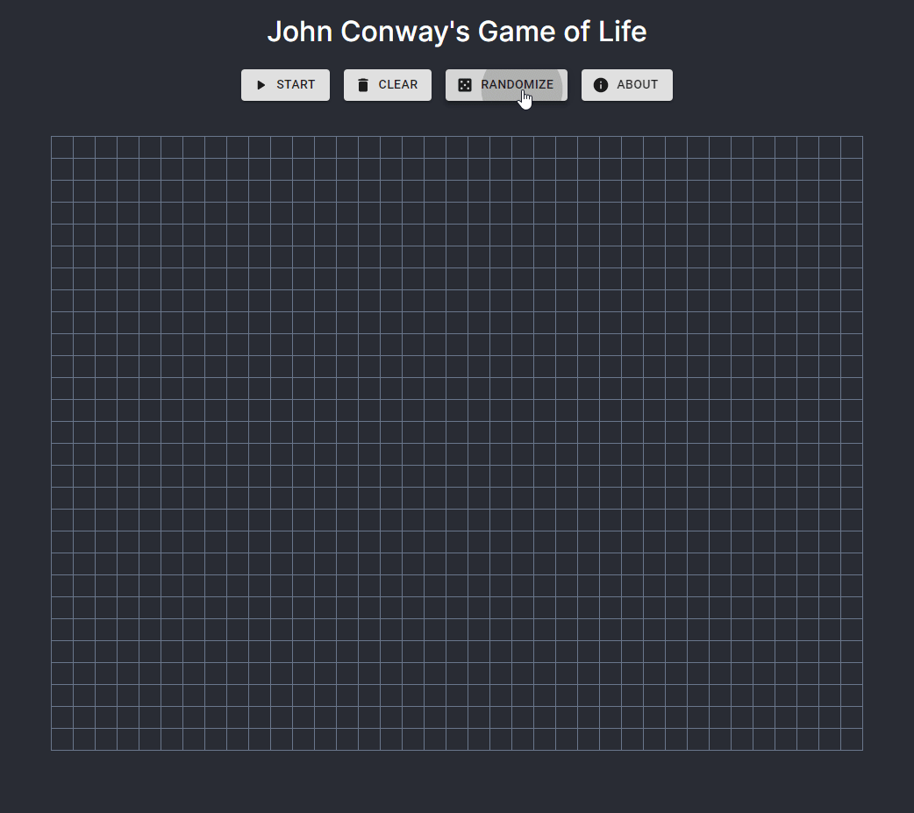

# Game of Life

John Conway's game of life made in React.
Create an initial configuration and observe how it evolves.

- Any live cell with fewer than two live neighbours dies, as if by underpopulation.
- Any live cell with two or three live neighbours lives on to the next generation.
- Any live cell with more than three live neighbours dies, as if by overpopulation.
- Any dead cell with exactly three live neighbours becomes a live cell, as if by reproduction.

Try it here: https://gol-conway.vercel.app/

